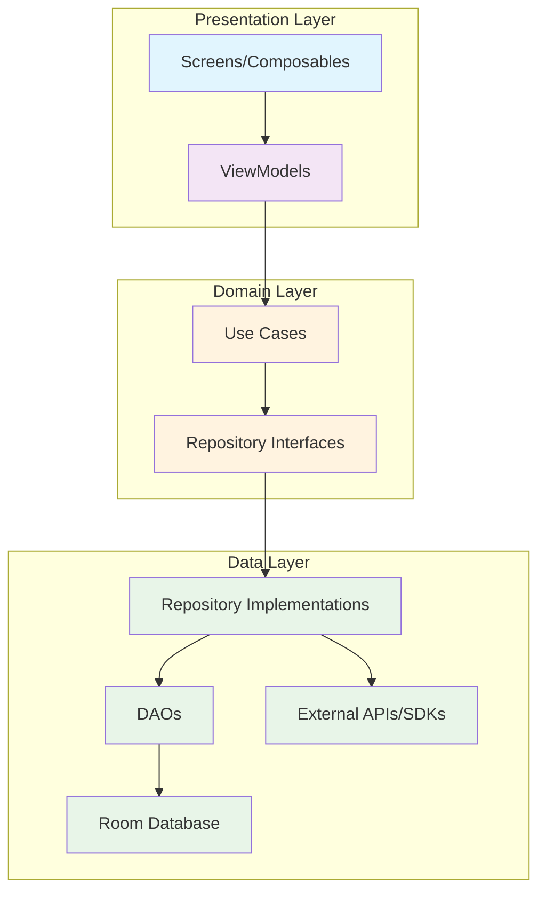
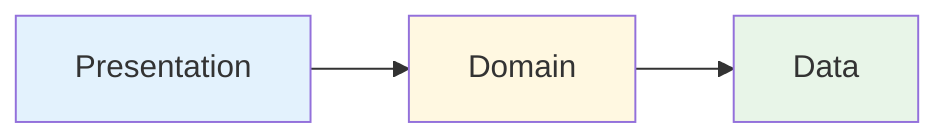
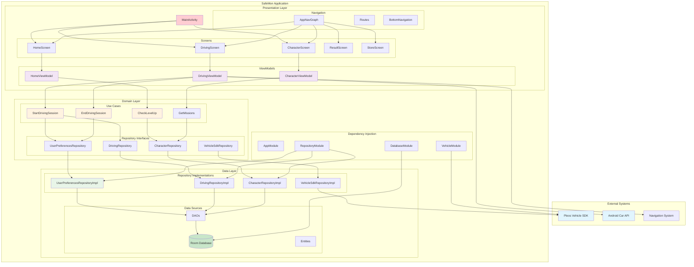
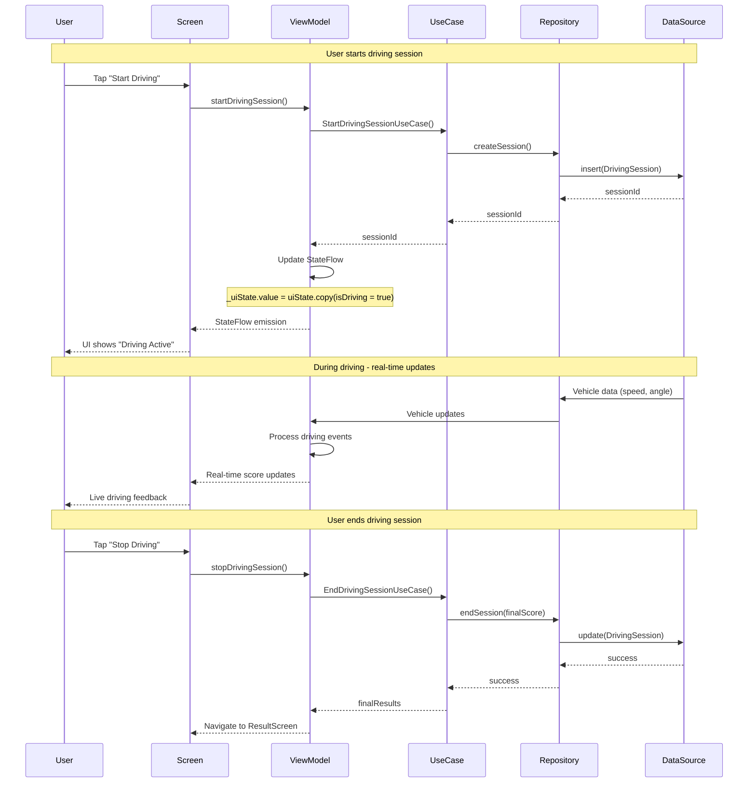
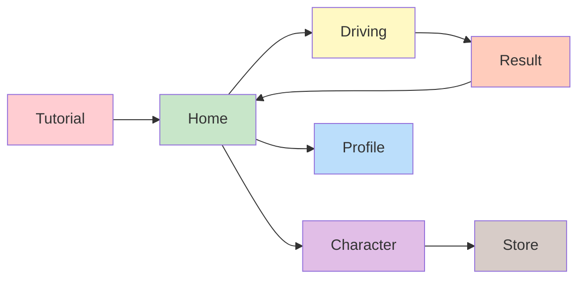
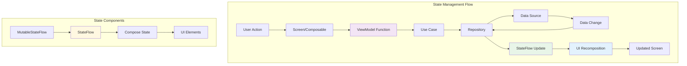
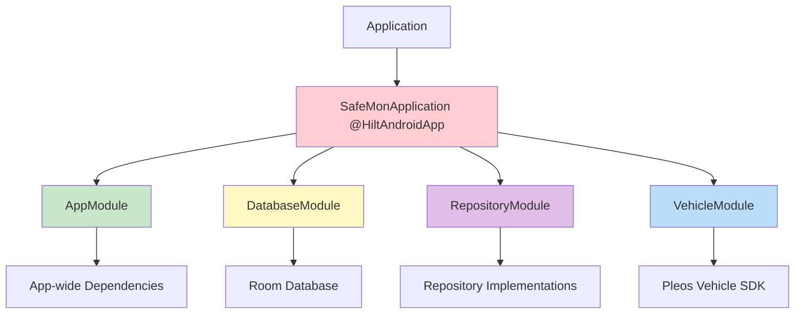

# Project Guide Documentation (version 0.1)
**Note**: This document is a work in progress and will be updated as the project evolves. It serves as a guide for developers to understand the architecture, structure, and best practices of the project.
**Note**: Parts of this document were created with the help of AI tools. It's reviewed and edited by the writher, but it may contain inaccuracies or outdated information. Please verify the information before using it in production.

---

## Table of Contents
1. [Glossary (for beginners)](#glossary-for-beginners)
2. [High-Level Project Structure](#high-level-project-structure)
3. [Architecture Pattern](#architecture-pattern)
4. [Architecture Diagrams](#architecture-diagrams)
5. [Pros of This Structure](#pros-of-this-structure)
6. [Navigation (currently 2.x)](#navigation-2x)
7. [State Management](#state-management)
8. [Dependency Injection](#dependency-injection)
9. [Where to Modify for Features](#where-to-modify-for-features)

---

## Glossary (for beginners)

### Essential Android Development Terms

**ViewModel**
- Stores and manages UI-related data in a lifecycle-conscious way
- Survives configuration changes (like screen rotation)
- Examples: `HomeViewModel`, `DrivingViewModel`, `CharacterViewModel`

**StateFlow**
- A hot Flow that represents a state with a current value
- Emits current state value to new collectors
- UI automatically updates when state changes
- Replaces LiveData in modern Android development

**Composable**
- A function that can be called by the Compose runtime to describe part of your UI
- Marked with `@Composable` annotation
- Examples: `HomeScreen()`, `DrivingScreen()`, `CharacterScreen()`

**Repository Pattern**
- Design pattern that encapsulates the logic needed to access data sources
- Centralizes common data access functionality
- Provides better maintainability and decouples the infrastructure or technology used to access databases from the domain model layer

**Clean Architecture**
- A software design philosophy that separates elements of a design into ring levels
- The main rule: source code dependencies can only point inwards
- Layers: Presentation → Domain → Data

**Use Case (Interactor)**
- Represents a single unit of business logic
- Contains the application-specific business rules
- Examples: `StartDrivingSessionUseCase`, `EndDrivingSessionUseCase`

**Entity**
- Represents a table in your Room database
- Annotated with `@Entity`
- Examples: `UserPreferences`, `Character`, `DrivingSession`

**DAO (Data Access Object)**
- Provides an API for reading and writing data
- Interface that defines database operations
- Room generates the implementation automatically

**Dependency Injection (DI)**
- A technique whereby one object supplies the dependencies of another object
- Hilt handles this automatically in SafeMon
- Makes code more testable and maintainable

**Navigation Component**
- Framework for navigating between destinations (screens) within an Android app
- **Note**: This is NOT a map navigation app - it's for moving between app screens!
- Type-safe navigation between screens
- Handles back stack and deep links

**Jetpack Compose**
- Android's modern toolkit for building native UI
- Declarative UI framework (you describe what the UI should look like)
- Replaces traditional XML layouts

**Room Database**
- Persistence library that provides an abstraction layer over SQLite
- Compile-time verification of SQL queries
- Type-safe database access

**Hilt**
- Dependency injection library for Android built on top of Dagger
- Reduces boilerplate code for dependency injection
- Provides containers for every Android class in your project

---

## High-Level Project Structure

```plaintext
app/src/main/java/com/gnapse/safemon/
├── data/                          # Data layer (databases, repositories)
│   ├── local/database/           # Room database components
│   │   ├── entities/            # Database tables (UserPreferences, Character, etc.)
│   │   └── dao/                 # Data Access Objects (CRUD operations)
│   ├── model/                   # Data models and DTOs
│   └── repository/              # Repository implementations
├── domain/                       # Business logic layer
│   ├── repository/              # Repository interfaces (contracts)
│   └── usecase/                 # Business use cases
├── presentation/                 # UI layer
│   ├── screens/                 # Feature-based screens
│   │   ├── main/               # Home, Profile screens + HomeViewModel
│   │   ├── driving/            # Driving screen + DrivingViewModel
│   │   └── character/          # Character screen + CharacterViewModel
│   └── navigation/             # Navigation setup
├── di/                          # Dependency Injection modules
└── ui/theme/                    # Material Design theme
```

---

## Architecture Pattern

The project follows **Clean Architecture** principles with clear separation of concerns

### Architecture Layers Overview



---

### Layer Responsibilities

**1. Presentation Layer (`presentation/`)**

- **ViewModels**: Manage UI state, handle user interactions
- **Screens/Composables**: Display UI using Jetpack Compose
- **Navigation**: Handle screen transitions

**2. Domain Layer (`domain/`)**

- **Use Cases**: Contain business logic (e.g., `StartDrivingSessionUseCase`)
- **Repository Interfaces**: Define contracts for data access
- **Models**: Business entities and logic

**3. Data Layer (`data/`)**

- **Repository Implementations**: Fetch data from databases/APIs
- **DAOs**: Database access objects for Room operations
- **Entities**: Database table definitions

### Dependency Flow



**Important**: Dependencies only flow inward. The inner layers (Domain) never know about outer layers (Presentation).

---

## Pros of This Structure

### 1. **Separation of Concerns**
- Each layer has a single, well-defined responsibility
- UI logic is separate from business logic
- Data access is abstracted from business rules
- Makes code easier to understand and maintain

### 2. **Testability**
- Each layer can be tested independently
- Business logic in Use Cases can be unit tested without Android dependencies
- ViewModels can be tested without UI components
- Repository pattern allows easy mocking of data sources

### 3. **Maintainability**
- Changes in one layer don't affect others
- Bug fixes are localized to specific layers
- Code is organized by feature, making it easy to find and modify
- Clear naming conventions and structure

### 4. **Scalability**
- Easy to add new features without breaking existing code
- Multiple developers can work on different layers simultaneously
- Modular structure supports large team development
- Clear interfaces between layers prevent tight coupling

### 5. **Flexibility**
- Easy to swap implementations (e.g., change database, add new data sources)
- Support for multiple UI frameworks (currently Compose, could add View system)
- Can easily add new external integrations (APIs, SDKs)
- Business logic is platform-independent

### 6. **Modern Android Best Practices**
- Follows Google's recommended app architecture
- Uses latest Android Jetpack libraries
- Implements reactive programming with StateFlow and Coroutines
- Material Design 3 theming
- Jetpack Compose for modern UI development

### 7. **Error Handling**
- Centralized error handling in repositories
- Clear error propagation through layers
- User-friendly error messages in UI
- Proper exception handling in Use Cases

### 8. **Performance**
- Room database provides efficient local storage
- StateFlow provides efficient state management
- Hilt provides efficient dependency injection
- Compose provides efficient UI rendering

---

## Architecture Diagrams

### Current Overall System Architecture
- **Note**: ignore CharacterScreen for now, it's going to be moved in the future
- **Note**: currently DrivingViewModel is directly accessing Android Car API and Pleos Vehicle SDK, which is not ideal. It should be abstracted through a repository.



### Data Flow Architecture




## Navigation (2.x)

The project currently uses **Navigation Compose 2.x** for handling screen navigation. (might migrate to 3.x in the future)

### Navigation Flow



### Key Navigation Files

- **`AppNavGraph.kt`**: Defines all navigation routes and screen destinations
- **`Routes.kt`**: Contains route constants for type-safe navigation
- **`NavigationActions.kt`**: Centralized navigation actions
- **`BottomNavigation.kt`**: Bottom navigation bar implementation

### Navigation Example
```kotlin
// In AppNavGraph.kt
composable(Routes.Driving) {
    DrivingScreen(
        onNavigateToResult = { score ->
            navController.navigate("${Routes.Result}/$score")
        }
    )
}
```

## State Management

The project uses **StateFlow** with **Jetpack Compose** for reactive state management. This provides efficient, type-safe state handling with automatic UI updates.

### State Management Architecture


### StateFlow Example
```kotlin
// In HomeViewModel.kt
@HiltViewModel
class HomeViewModel @Inject constructor(
    private val userPreferencesRepository: UserPreferencesRepository
) : ViewModel() {
    
    private val _uiState = MutableStateFlow(HomeUiState())
    val uiState: StateFlow<HomeUiState> = _uiState.asStateFlow()
    
    init {
        loadUserData()
    }
    
    private fun loadUserData() {
        viewModelScope.launch {
            userPreferencesRepository.getUserPreferences()
                .collect { preferences ->
                    _uiState.value = _uiState.value.copy(
                        userLevel = preferences.characterLevel,
                        totalPoints = preferences.totalPoint
                    )
                }
        }
    }
}
```

### UI State Data Classes
```kotlin
data class HomeUiState(
    val isLoading: Boolean = false,
    val userLevel: Int = 1,
    val totalPoints: Int = 0,
    val currentCharacter: String = "",
    val error: String? = null
)
```

### Benefits of This State Management Approach

**1. Reactive UI Updates**
- UI automatically updates when state changes
- No manual UI refresh needed
- Efficient recomposition only when necessary

**2. Type Safety**
- Compile-time checking of state properties
- Clear state structure with data classes
- IDE support for state access

**3. Lifecycle Awareness**
- StateFlow survives configuration changes
- Automatic cleanup when ViewModel is cleared
- Works seamlessly with Compose lifecycle

**4. Testability**
- Easy to test state changes in ViewModels
- Can verify state updates without UI
- Mock repositories for isolated testing

**5. Performance**
- StateFlow only emits when state actually changes
- Compose only recomposes affected UI elements
- Efficient memory usage with state sharing

---

## Dependency Injection

The project uses **Hilt** for dependency injection, providing automatic dependency management and improved testability.

### DI Module Structure



### Key DI Files

**1. `DatabaseModule.kt`** - Provides Room database and DAOs
```kotlin
@Module
@InstallIn(SingletonComponent::class)
object DatabaseModule {
    
    @Provides
    @Singleton
    fun provideAppDatabase(@ApplicationContext context: Context): SafeMonDatabase {
        return Room.databaseBuilder(
            context,
            SafeMonDatabase::class.java,
            "safemon_database"
        ).build()
    }
    
    @Provides
    fun provideUserPreferencesDao(database: SafeMonDatabase): UserPreferencesDao {
        return database.userPreferencesDao()
    }
}
```

**2. `RepositoryModule.kt`** - Binds repository interfaces to implementations
```kotlin
@Module
@InstallIn(SingletonComponent::class)
abstract class RepositoryModule {
    
    @Binds
    abstract fun bindUserPreferencesRepository(
        userPreferencesRepositoryImpl: UserPreferencesRepositoryImpl
    ): UserPreferencesRepository
}
```

**3. `VehicleModule.kt`** - Provides Pleos SDK components
```kotlin
@Module
@InstallIn(SingletonComponent::class)
object VehicleModule {
    
    @Provides
    @Singleton
    fun provideVehicle(@ApplicationContext context: Context): Vehicle {
        return Vehicle.getInstance(context)
    }
}
```

---

### Benefits of Hilt DI

**1. Automatic Dependency Management**
- No manual object creation
- Automatic lifecycle management
- Singleton pattern handled automatically

**2. Compile-time Safety**
- Compile-time dependency verification
- Missing dependencies caught at build time
- Type-safe dependency injection

**3. Testing Benefits**
- Easy to provide test implementations
- Can inject mocks for unit testing
- Isolated testing of components

**4. Performance**
- Efficient object creation and sharing
- Lazy initialization when needed
- Memory efficient singleton management

**5. Maintainability**
- Clear separation of object creation and usage
- Easy to modify dependency graphs
- Centralized dependency configuration

---
## Where to Modify for Features

### Adding a New Screen

**1. Create UI Layer**
```
presentation/screens/newfeature/
├── NewFeatureScreen.kt        # Composable UI
├── NewFeatureViewModel.kt     # State management
└── NewFeatureUiState.kt      # UI state data class
```

**2. Add Navigation**
- Add route to `Routes.kt`
- Update `AppNavGraph.kt` with new destination
- Add navigation actions to `NavigationActions.kt`

**3. Add Business Logic (if needed)**
```
domain/usecase/newfeature/
└── NewFeatureUseCase.kt       # Business logic
```

### Adding Database Entity

**1. Create Entity**
```kotlin
// In data/local/database/entities/
@Entity(tableName = "new_table")
data class NewEntity(
    @PrimaryKey val id: Int,
    val name: String
)
```

**2. Create DAO**
```kotlin
// In data/local/database/dao/
@Dao
interface NewEntityDao {
    @Query("SELECT * FROM new_table")
    fun getAll(): Flow<List<NewEntity>>
    
    @Insert
    suspend fun insert(entity: NewEntity)
}
```

**3. Update Database**
```kotlin
// In SafeMonDatabase.kt
@Database(
    entities = [UserPreferences::class, NewEntity::class],
    version = 3, // Increment version
    exportSchema = false
)
```

### Adding Repository

**1. Create Interface**
```kotlin
// In domain/repository/
interface NewRepository {
    suspend fun getData(): Flow<List<Data>>
}
```

**2. Create Implementation**
```kotlin
// In data/repository/
@Singleton
class NewRepositoryImpl @Inject constructor(
    private val dao: NewEntityDao
) : NewRepository {
    override suspend fun getData(): Flow<List<Data>> = dao.getAll()
}
```

**3. Add to DI Module**
```kotlin
// In di/RepositoryModule.kt
@Binds
abstract fun bindNewRepository(
    impl: NewRepositoryImpl
): NewRepository
```

### Modifying Existing Features

**Character System** → `presentation/screens/character/`
- **CharacterViewModel.kt**: Character state and progression logic
- **CharacterScreen.kt**: Character UI and animations

**Driving System** → `presentation/screens/driving/`
- **DrivingViewModel.kt**: Pleos SDK integration and scoring
- **DrivingScreen.kt**: Real-time driving interface

**User Profiles** → `presentation/screens/main/`
- **HomeViewModel.kt**: User data and statistics
- **ProfileScreen.kt**: User profile settings

**Data Models** → `data/local/database/entities/`
- Modify existing entities for schema changes
- Remember to increment database version

---
